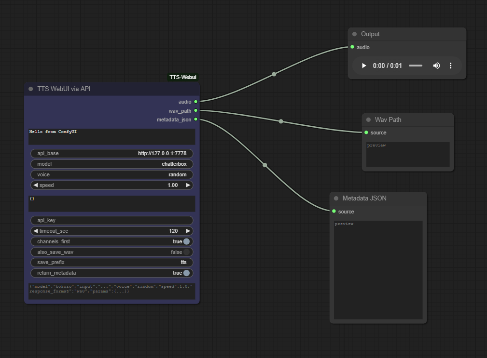

# ComfyUI node: TTS WebUI (OpenAI-style)

This package provides a single ComfyUI custom node that calls a TTS WebUI OpenAI-style HTTP endpoint (POST /v1/audio/speech) and returns in-memory AUDIO usable in ComfyUI workflows.



## What it does

- Sends text + options to a TTS WebUI endpoint and requests WAV output.
- Converts the returned WAV bytes into a ComfyUI AUDIO object (torch.Tensor waveform + sample rate).
- Optionally saves the WAV to the ComfyUI output/audio folder and returns metadata JSON.

## Node

- Display name: "TTS WebUI via API"
- Internal class: `TTSWebUI_OpenAI_TTS`

### Inputs (required)
- text (STRING, multiline) — text to synthesize
- model (STRING) — model/preset name (e.g. `kokoro`, `chatterbox`)
- voice (STRING) — voice preset or file path; `random` supported by some servers
- speed (FLOAT) — playback speed multiplier (1.0 default)
- params_json (STRING, JSON) — optional model params (e.g. temperature, rvc_params)
- api_base (STRING) — base URL of your TTS WebUI (default: `http://127.0.0.1:7778`)

### Optional inputs
- api_key (STRING, password) — API key for the TTS server (if required)
- timeout_sec (INT) — request timeout in seconds
- channels_first (BOOLEAN) — AUDIO layout: (C, N) if True else (N, C)
- also_save_wav (BOOLEAN) — if True, saves a WAV under output/audio and returns the path
- save_prefix (STRING) — filename prefix for saved WAVs
- return_metadata (BOOLEAN) — if True, returns a metadata JSON string
- advanced_request_json (STRING) — raw JSON to fully override the default payload

### Returns
- AUDIO — ComfyUI-compatible audio object: {"waveform": torch.Tensor, "sample_rate": int}
- STRING — saved WAV path (empty if disabled)
- STRING — metadata JSON (empty if disabled)

## Example (advanced_request_json)

Use `advanced_request_json` to craft the exact payload sent to `/v1/audio/speech`, for example:

```json
{
	"model": "kokoro",
	"input": "Hello from ComfyUI",
	"voice": "random",
	"speed": 1.0,
	"response_format": "wav",
	"params": {"temperature": 0.7}
}
```

## Installation / Requirements

1. Place this folder inside your ComfyUI `custom_nodes` directory.
2. Ensure the environment has these Python packages installed: `requests`, `numpy`, `torch`.
	 - If your ComfyUI environment already has `torch` installed, no extra action is required.

## Usage notes

- If your TTS server requires an API key you can either:
	- pass it into the `api_key` input, or
	- set the environment variable `TTS_WEBUI_OPENAI_API_KEY` to your API key (preferred for this node).
	- For backward compatibility the module will also check `SAI_API_KEY`.
	- As a local-file fallback the helper also reads `tts_api_key.txt` or `sai_platform_key.txt` placed next to the custom node.

	The node will set the HTTP header `Authorization: Bearer <key>` when a key is found.
- Saved WAV files are written to `output/audio` by default; the helper `get_output_directory()` reads `folder_paths.get_output_directory()` if available or falls back to the current working directory.
- The node expects the server to return a WAV; other formats may fail conversion.

## Files in this package

- `tts_webui_openai_tts.py` — main node implementation
- `__init__.py` — package exports for ComfyUI (updated to expose the TTS node)
- `LICENSE` — license for this package

## Notes

- This repository was adapted from a Stability AI template; the stability-related code has been removed and replaced with the TTS WebUI node.

---

License: see `LICENSE`

```
